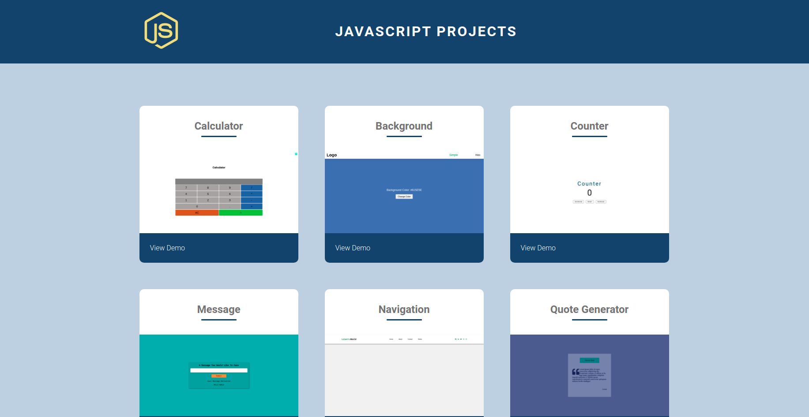

# JAVASCIPT PROJECTS

This website lists some of the javascript projects that I have done.

## <a href="https://sandarvashakya.github.io/Javascript-Projects/">List of javascript projects</a>

1. <a href="https://sandarvashakya.github.io/Simple-Calculator/" target="_blank">Calculator</a>
2. <a href="https://sandarvashakya.github.io/background/" target="_blank" target="_blank">Background Color Changer</a>
3. <a href="https://sandarvashakya.github.io/counter/" target="_blank">Counter App</a>
4. <a href="https://sandarvashakya.github.io/message/" target="_blank">Message Display</a>
5. <a href="https://sandarvashakya.github.io/nav-bar/" target="_blank">Responsive Navigation</a>
6. <a href="https://sandarvashakya.github.io/Quote-Genetrator/" target="_blank">Quote Generator</a>
7. <a href="https://sandarvashakya.github.io/sidebar/" target="_blank">Responsive Sidebar</a>
8. <a href="https://sandarvashakya.github.io/Tip-Calculator/" target="_blank">Tip Calculator</a>
9. <a href="https://sandarvashakya.github.io/reviews/" target="_blank">Reviews</a>

